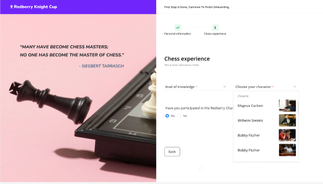

# Team-4: Collaborative ReactJS Project: Redberry Knight Cup

🚀👥✨

## Built with ReactJS and React Libraries

This collaborative project was built using ReactJS, a popular JavaScript library for building user interfaces. Throughout the development process, we leveraged various React libraries to enhance the functionality and efficiency of our project. Some of the notable libraries we utilized include:

- React-Select, which provided us with powerful and customizable select input components. ✅

- Native CSS for creating beautiful UI components. 🎨

- Axios for making API requests and handling asynchronous operations. ⚙️

## Team and Collaboration

Our project brought together a team of three talented developers:

- ### Ani Beroshvili
- ### Beka Jorjikia
- ### Mako Dolidze
  and a dedicated mentor
- ### Levan Iakobidze
  Together, we collaborated, brainstormed ideas, and worked diligently to bring this project to life. The collective efforts of our team members allowed us to tackle complex challenges and achieve remarkable results.

## Version Control with GitHub and Git Commands

🐙📜🔀

To streamline our collaborative efforts and ensure version control, we relied on GitHub, a web-based hosting service for Git repositories. By leveraging Git's powerful command-line interface, we successfully managed different versions of our project and facilitated seamless collaboration among team members.

Some of the Git commands we frequently used during the development process include:

- `git clone`: To clone the project repository onto our local machines.
- `git branch`: To create and manage different branches for implementing new features and fixing bugs.
- `git add`: To stage changes and prepare them for commit.
- `git commit`: To save changes with a descriptive commit message.
- `git push`: To upload local commits to the remote repository on GitHub.
- `git pull`: To fetch and merge the latest changes from the remote repository to our local branch.

## Learning and Overcoming Challenges

📚🔍💪

Throughout this project, we encountered numerous challenging aspects that required precise attention to detail. One of the significant challenges we faced was implementing extensive form validations. We had to ensure that user inputs were validated accurately and displayed appropriate error messages when necessary.

However, these difficulties served as valuable learning opportunities, enabling us to grow both individually and as a team. By tackling intricate problems and implementing advanced features, we deepened our understanding of ReactJS and its associated libraries. We enhanced our skills in handling complex state management, optimizing performance, and integrating external APIs. This project truly pushed the boundaries of our knowledge and allowed us to gain valuable hands-on experience.

## Conclusion

✅🎉🙌

In conclusion, our collaborative ReactJS project has been a tremendous success. With the power of React and the combined efforts of our team, we have created a remarkable application that showcases our skills and dedication.

This project has not only solidified our understanding of ReactJS but has also taught us invaluable lessons in teamwork, communication, and problem-solving. We are proud of what we have accomplished and look forward to future collaborations that will continue to expand our knowledge and expertise.

🌟👏🎊
